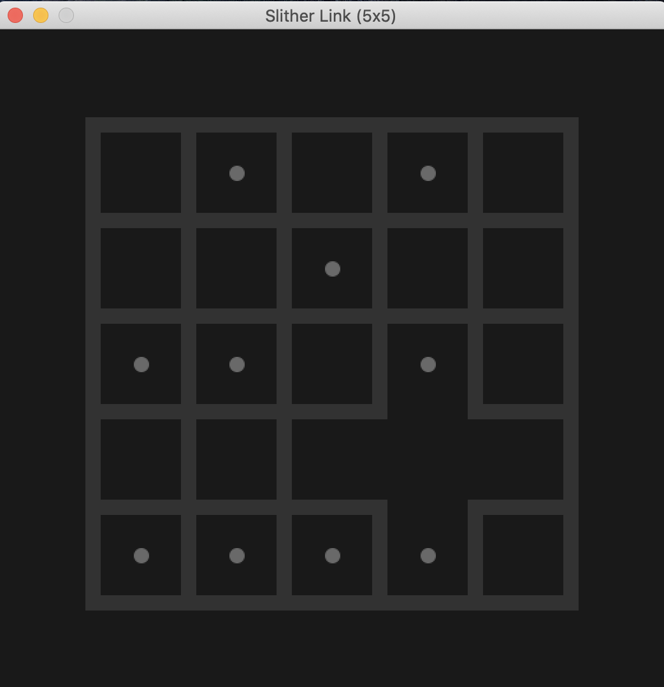
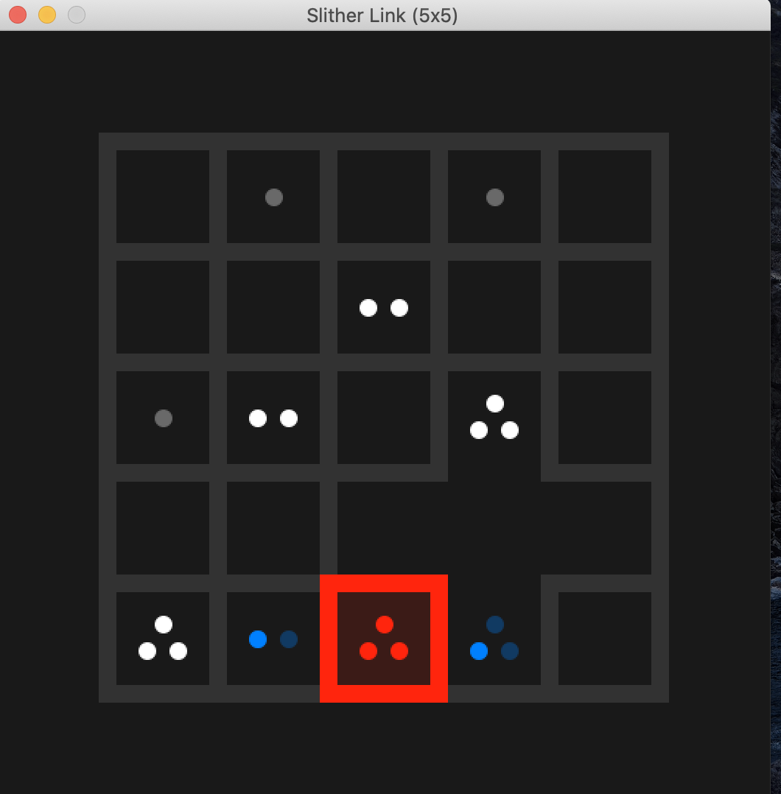
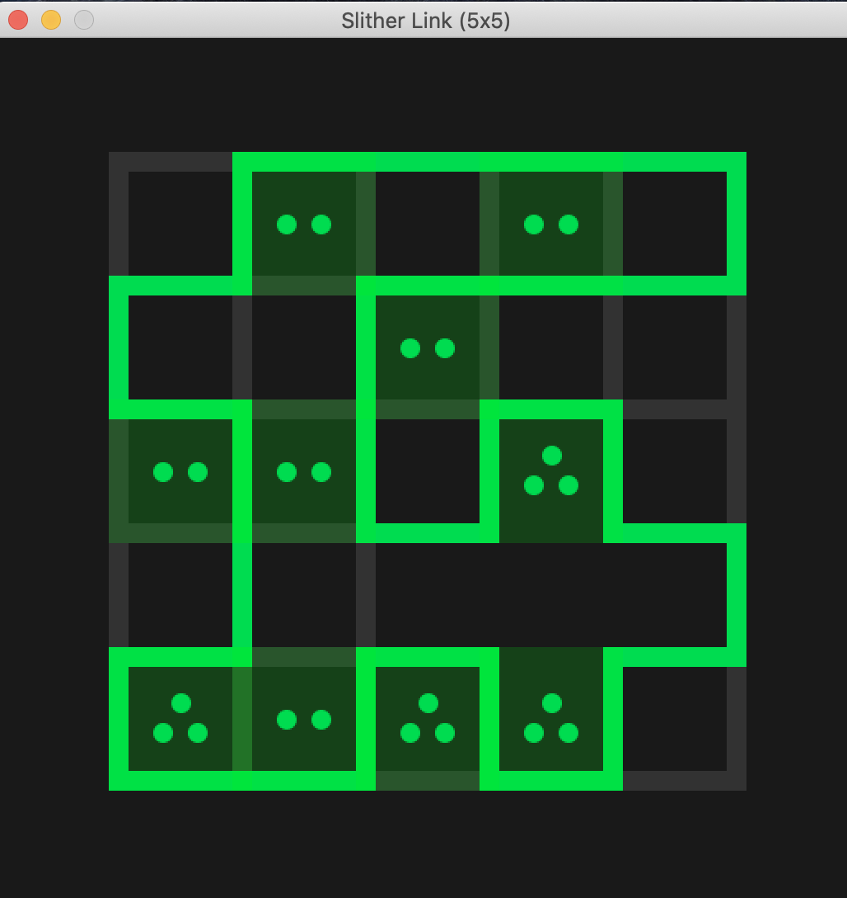

# Running The Game
Simply clone this repository and run the SlitherLink.java file.

# Changing Boards
By default this java file will use the eg_5_2.txt file to initialise the game board.
To choose a different board simply choose one of the other eg txt files as a parameter in line 57 of SlitherLink.java

# Changing Themes
There are two themes to choose from for your board, default (light theme) or dark.
To change the theme simply supply either default or dark as a string argument in line 72 of SlitherLink.java

# Game States

## Intial puzzle (using eg5_2.txt as the puzzle):

## Incorrect moves will turn lines around cell Red:

## Example of a solved puzzle:

